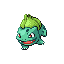

# PokeGAN
Using a Deep Convolutional Generative Adverserial Network (DCGAN) to generate fake pokemon sprites.

## Dataset
* All sprites were downloaded [this website](https://veekun.com/dex/downloads)
* All images were scaled down to 64x64 RGB, superimposed onto a white background so all alphas were turned white

* Sprites from generation 4 and up were chosen since the art tended to be similar from those games and the newer ones

Gen 1 | Gen 2 | Gen 3 | Gen 4 | Gen 5
------|-------|-------|-------|------
||||
||||
||||

* All Unown sprites were removed due to their similarity to letters and drastic difference aesthetically to other pokemon. What a boring pokemon!

## Network Architectures
* This network used Tensorflow with Keras
* Generator was built with the following layers
    1. Input (1x100) -> Dense -> BatchNormalization -> LeakyReLU -> Reshape(4x4x1024)
    2. Conv2DTranspose -> BatchNormalization -> LeakyReLU
    3. Conv2DTranspose -> BatchNormalization -> LeakyReLU
    4. Conv2DTranspose -> BatchNormalization -> LeakyReLU
    5. Conv2DTranspose -> tanh
    * This outputs a 64x64x3 tensor which can be viewed as an image
* Discriminator was built with the following layers
    1. Input (64x64x3) -> Conv2D -> LeakyReLU -> Dropout
    2. Conv2D -> LeakyReLU -> Dropout
    3. Conv2D -> LeakyReLU -> Dropout
    4. Flatten -> Dense
    * This outputs a score, which should be 1 if the image is real, 0 if fake

## Results
### Epoch 1

### Epoch 100

### Epoch 200

### Epoch 300

Here are a few of my favourites!

## Next Steps
* Testing the architectures
    * Adding dropouts to the generator [(here for more details)](https://github.com/soumith/ganhacks)
    * Optimizing the hyperparameters:
        * Optimizers: LR, Beta1
* Putting the images through an upsampling algorithm to get more detail
* Have an artist use them as inspiration